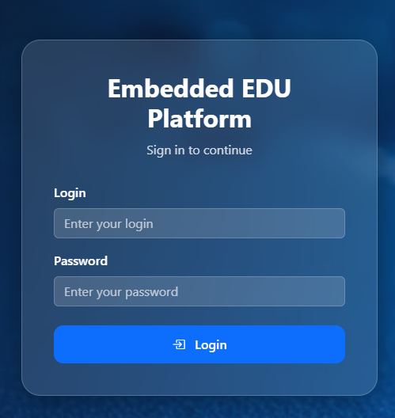
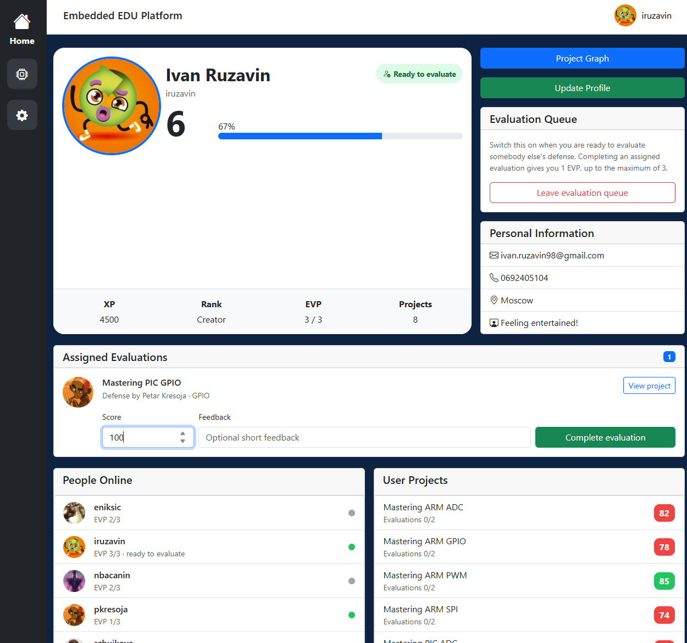
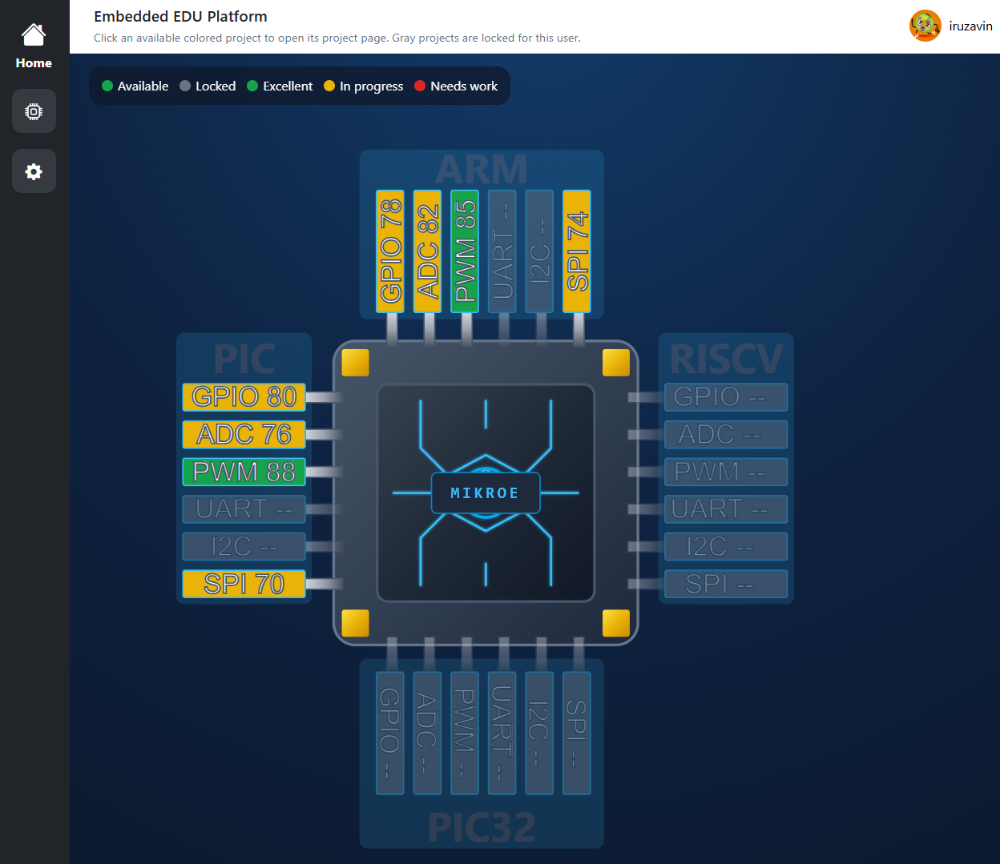
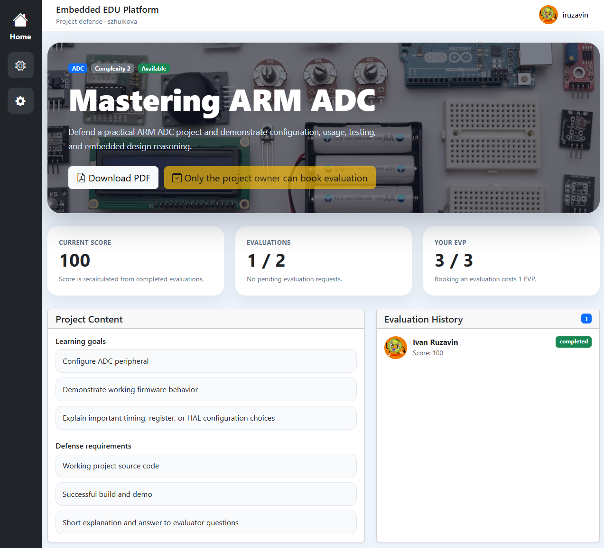
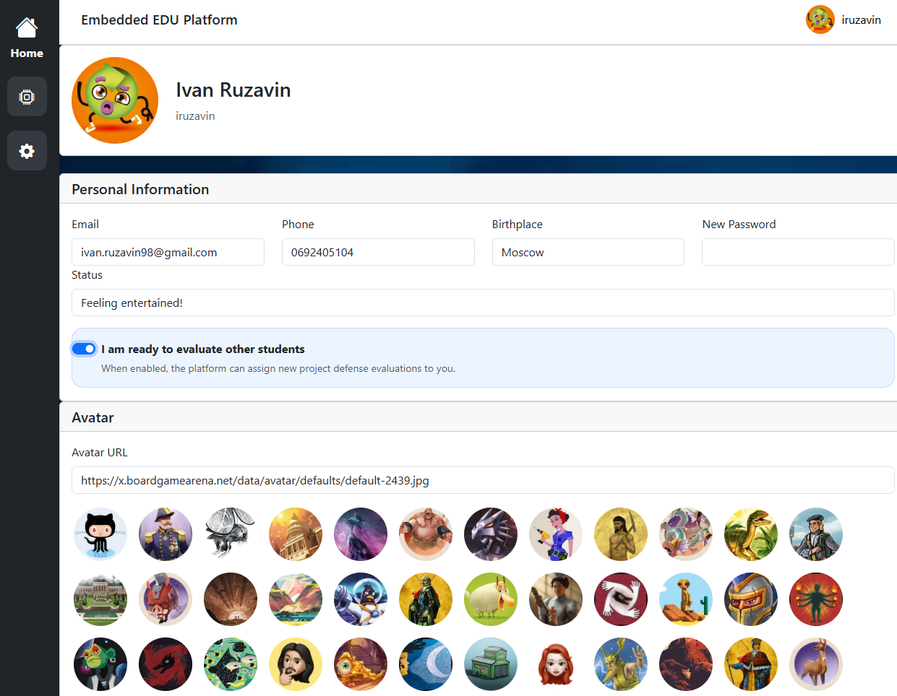

# Embedded EDU Platform -- Project Documentation

## Overview

The Embedded EDU Platform is a Vue.js frontend connected to a Node.js
backend API. It is designed to support embedded-systems education
through a project-based learning workflow, project evaluations, and
progress tracking.

The platform contains four primary user-facing pages:

1.  Login Page (`Login.vue`)
2.  Home Dashboard (`Home.vue`)
3.  Project Graph (`Graph.vue`)
4.  Project Details (`ProjectDetails.vue`)
5.  Settings Page (`Settings.vue`)

------------------------------------------------------------------------

# Application Workflow

## 1. Authentication



### Purpose

Allows a user to authenticate using:

-   UID
-   Password

### Logic

When the Login button is pressed:

``` javascript
POST /auth/login
```

If authentication succeeds:

-   JWT token is stored in `localStorage`
-   User UID is stored in `localStorage`
-   User is redirected to `/home`

If authentication fails:

-   Error message is displayed

------------------------------------------------------------------------

# 2. Home Dashboard



### Purpose

Main platform dashboard.

Displays:

-   User profile
-   XP
-   Level
-   Rank
-   EVP (Evaluation Points)
-   Online users
-   User projects
-   Assigned evaluations

### Logic

When the page loads:

``` javascript
GET /users/:uid
```

The application loads:

-   Current user
-   User projects
-   Online users
-   Assigned evaluations

The user is automatically marked as:

``` javascript
is_online = 1
```

and marked offline on logout or browser close.

### Features

#### Profile Information

Displays:

-   Avatar
-   Name
-   UID
-   Progress
-   XP
-   Rank
-   EVP

#### User Navigation

Selecting another user:

``` javascript
GET /users/:uid
GET /projects/:uid
```

allows viewing:

-   Profile
-   Projects
-   Progress

#### Evaluation Queue

Users can enable:

``` text
Ready for evaluation
```

which allows the platform to assign project reviews to them.

#### Assigned Evaluations

Assigned evaluators can:

-   Open project
-   Enter score
-   Enter feedback
-   Submit evaluation

Request:

``` javascript
POST /evaluations/{id}/complete
```

Effects:

-   Project score recalculated
-   Evaluator receives EVP
-   Evaluation marked completed

------------------------------------------------------------------------

# 3. Project Graph



### Purpose

Provides a visual learning roadmap represented as an MCU package.

Supported learning paths:

-   ARM
-   PIC
-   RISCV
-   PIC32

Each peripheral becomes a project node:

-   GPIO
-   ADC
-   PWM
-   UART
-   I2C
-   SPI

### Logic

Projects are loaded from:

``` javascript
GET /projects/:uid
```

The graph determines:

-   Available projects
-   Locked projects
-   Project scores

### Score Coloring

|  Score          | Color   |
|  ---------------| --------|
|  \>= 85         | Green   |
|  \>= 50         | Yellow  |
|  \< 50          | Red     |
|  Not Available  | Gray    |

### Navigation

Selecting a project:

``` javascript
router.push("/projects/{projectId}")
```

opens the Project Details page.

### Additional Features

-   SVG based visualization
-   Zoom support
-   Drag/Pan support
-   Dynamic project availability

------------------------------------------------------------------------

# 4. Project Details



### Purpose

Displays all information related to a project defense.

### Loaded Data

``` javascript
GET /projects/project/{projectId}
GET /evaluations/project/{projectId}/{uid}
```

### Displayed Information

-   Project image
-   Description
-   Learning goals
-   Requirements
-   Current score
-   Evaluation statistics
-   Evaluation history

### PDF Download

Users can download the project documentation PDF.

### Evaluation Booking

Project owners may request evaluations.

Requirements:

-   Project available
-   User owns project
-   User has EVP \> 0
-   Required evaluation count not reached

Request:

``` javascript
POST /evaluations/book
```

Effects:

-   EVP reduced
-   Evaluator assigned
-   New evaluation created

### Evaluation History

Displays:

-   Evaluator name
-   Status
-   Score
-   Feedback

------------------------------------------------------------------------

# 5. Settings Page



### Purpose

Allows users to manage their profile.

### Editable Fields

-   Email
-   Phone
-   Birthplace
-   Password
-   Status
-   Avatar
-   Ready for evaluation

### Save Operation

``` javascript
PUT /users/:uid
```

Updated fields:

-   Personal information
-   Avatar
-   Password
-   Evaluation status

### Avatar Selection

Users may:

-   Enter avatar URL manually
-   Select predefined avatar from avatar gallery

------------------------------------------------------------------------

# Evaluation System

## Overview

The evaluation system is the core educational mechanism.

### Evaluation Lifecycle

1.  Student completes project.
2.  Student spends EVP.
3.  Evaluation request is created.
4.  Available evaluator is assigned.
5.  Evaluator submits score and feedback.
6.  Project score is recalculated.
7.  Evaluator receives EVP.

### Benefits

-   Encourages peer review.
-   Encourages project completion.
-   Prevents abuse through EVP limits.
-   Supports collaborative learning.

------------------------------------------------------------------------

# Package Dependencies

Install:

1) Bun - https://bun.com/docs/installation
``` bash
cd edu-platform-frontend
bun add axios bootstrap bootstrap-icons vue-flow
```

2) Node package manager - https://nodejs.org/en/download


``` bash
npm install bootstrap-icons
cd ../edu-platform-backend
npm install nodemon
```

------------------------------------------------------------------------

# Build and run

``` bash
cd edu-platform-frontend
npm run dev
```

``` bash
cd edu-platform-backend
node server.js
```

------------------------------------------------------------------------
